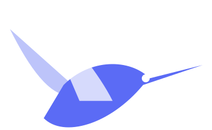

<div align="center">



## Aves-Next

![Build badge][Build badge]

Aves-Next is a community fork of Aves, a gallery and metadata explorer app built for Android with Flutter. The project focuses on independent Aves-Next branding and Android builds without Firebase or Google Play Services integration.

## Downloads

Aves-Next currently publishes two Android build variants:

- **Libre** — the general free/open-source build.
- **Izzy** — the build intended for distribution through the IzzyOnDroid/F-Droid ecosystem.

Release APKs are currently produced by GitHub Actions as workflow artifacts. Open the [Build APK workflow](https://github.com/CookieCums/Aves-Next/actions/workflows/build-apk.yml), select a successful run, and download its artifact. Each verified build contains three ABI-split APKs for both Libre and Izzy.

There are no official Aves-Next Google Play releases at this time, so this README does not advertise the old Aves Play listing or old package IDs.

## Features

Aves-Next can handle all sorts of images and videos, including typical JPEGs and MP4s, as well as more exotic formats such as **multi-page TIFFs, SVGs, old AVIs and more**.

It scans your media collection to identify **motion photos**, **panoramas** (aka photo spheres), **360° videos**, as well as **GeoTIFF** files.

**Navigation and search** are important parts of Aves-Next. The goal is to let users move easily from albums to photos to tags, maps, and other views.

Aves-Next integrates with Android (including Android TV) with features such as **widgets**, **app shortcuts**, **screen saver** and **global search** handling. It also works as a **media viewer and picker**.

## Project Setup

### Requirements

Use the Flutter version bundled with this repository through `flutterw`. The repository and CI are configured around the project's current Flutter toolchain and Android build configuration.

### Run Libre

```bash
./scripts/apply_flavor_libre.sh
./flutterw run -t lib/main_libre.dart --flavor libre
```

### Run Izzy

```bash
./scripts/apply_flavor_izzy.sh
./flutterw run -t lib/main_izzy.dart --flavor izzy
```

### Build APKs

```bash
./scripts/apply_flavor_libre.sh
./flutterw build apk -t lib/main_libre.dart --flavor libre --split-per-abi

./scripts/apply_flavor_izzy.sh
./flutterw build apk -t lib/main_izzy.dart --flavor izzy --split-per-abi
```

### Release signing

Release signing information is intentionally kept outside the repository. Create a `key.properties` file in the **project root**; the Android build reads that file before configuring the release signing config. You can also provide the same values through environment variables for CI.

Use `android/key_template.properties` as the template. A PKCS#12 keystore is supported, including `.p12` or `.pfx` files:

```properties
storeFile=/absolute/path/to/aves-next-release.p12
storePassword=YOUR_STORE_PASSWORD
keyAlias=YOUR_KEY_ALIAS
keyPassword=YOUR_KEY_PASSWORD
storeType=pkcs12
```

Never commit `key.properties`, private signing keys, or keystore passwords. See the [Android signing configuration reference](https://developer.android.com/reference/tools/gradle-api/9.4/com/android/build/api/variant/SigningConfigInfo) for the current signing configuration API.

### Debugging Kotlin code

If attaching the debugger from Android Studio fails:
1. Open the `android` folder in Android Studio.
2. Open **Edit Configurations...**.
3. Select configuration `app`.
4. Open the **Debugger** tab.
5. Open **LLDB Post Attach Commands**.
6. Add:

```text
process handle SIGSEGV --pass true --stop false --notify true
```

## Permissions

Aves-Next requires a few permissions to do its job, including media/storage access, media locations, network access, and connection-state access where required by the corresponding feature.

## Contributing

### Issues and discussions

Bug reports and feature requests are welcome. Use the [Aves-Next issue tracker](https://github.com/CookieCums/Aves-Next/issues) and [discussions](https://github.com/CookieCums/Aves-Next/discussions).

### Code

At this stage this project does not accept pull requests while the fork is being stabilized and cleaned up.

## Donations

Aves-Next development can be supported directly through UPI.

**Recipient:** Spookie  
**UPI ID:** `godzspooky@okaxis`

[Pay via UPI](upi://pay?pa=godzspooky%40okaxis&pn=Spookie&cu=INR)

## License

Aves-Next remains licensed under the BSD 3-Clause License. See [LICENSE](https://github.com/CookieCums/Aves-Next/blob/develop/LICENSE).

[Build badge]: https://img.shields.io/github/actions/workflow/status/CookieCums/Aves-Next/build-apk.yml?branch=develop
